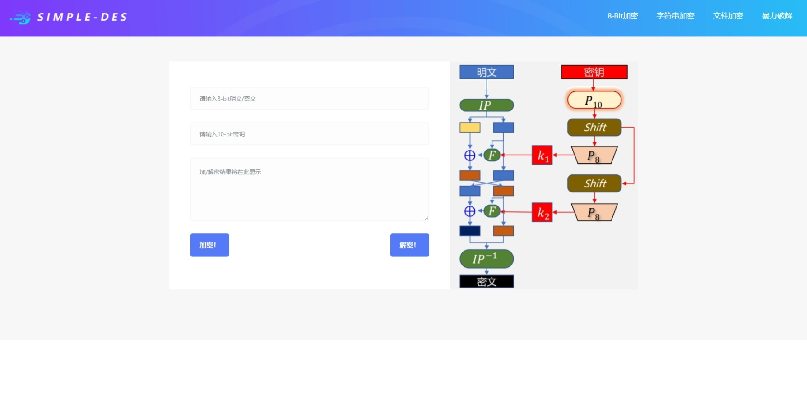

# SIMPLE-DES Encrypt System
运用简易DES加密解密算法实现8-bit二进制数加解密、字符串加解密、文件加解密和暴力破解获取密钥。
该系统用python+flask+bootstrap实现。
## Introduction
`result`存放了服务器端执行文件加密或解密后的结果.

`static`存放了前端页面所需的样式表(css)，字体(font)，图片(image, picture)和控制流代码(js).

`templates`存放了网页的html模板

`upload`存放了客户端上传的待加密或解密的文件

`SimpleDes.py`是加密算法的具体实现

`app.py`是程序的入口
## Environments
python=3.9
```sh
pip install -r requirements.txt
```
## Run
在根目录下运行
```sh
python app.py
```
## System Main Interface
访问localhost的5000号端口
`http://127.0.0.1:5000` .
系统主界面如下



## API Help Document
`APIHelpDocument.docx`中提供了可在控制台调用的API，并指定了输入输出格式.

## Test Report
`Report.docx`中展示了对系统的功能测试以及结果.

## User Guide

`Guide.md`中提供了供用户阅读的使用手册


